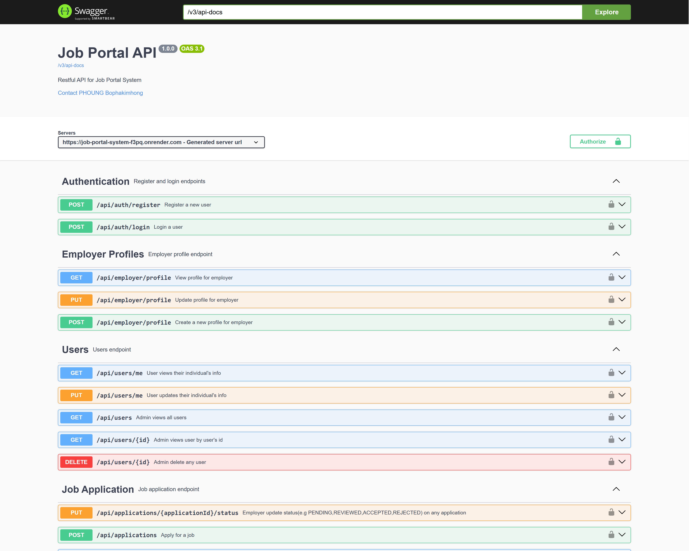
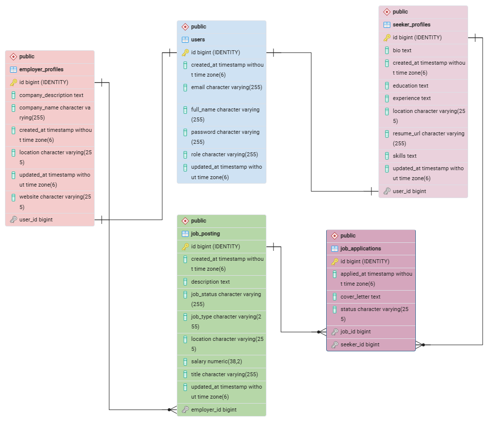
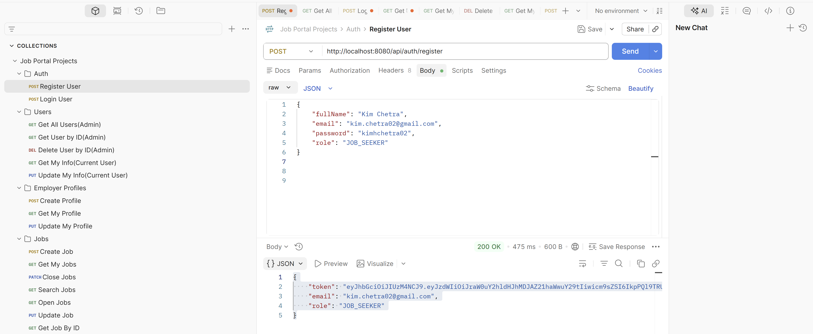

# Job Portal System

A full-featured Job Portal REST API built with Java Spring Boot. It supports job seekers, employers, and administrators through JWT authentication, role-based authorization, job management, resume uploads, and application tracking.

---

## 🚀 Live Demo

Backend API:
https://job-portal-system-f3pq.onrender.com

Swagger UI:
https://job-portal-system-f3pq.onrender.com/swagger-ui/index.html

---

## 📖 Features

### Authentication
- JWT Authentication
- Register & Login
- Role-based authorization
- Password encryption

### Job Management
- Create, update, delete jobs
- Search jobs
- Pagination
- Filter by keyword

### Job Applications
- Apply for jobs
- Track application status
- Employer reviews applications

### User Profiles
- Job Seeker Profile
- Employer Profile
- Resume PDF upload

### System Features
- Global Exception Handling
- Request Validation
- RESTful API
- Swagger/OpenAPI Documentation
- Email notifications (welcome, application confirmation, status updates)

---

## 🛠 Tech Stack

| Category | Technology |
|----------|------------|
| Language | Java 21 |
| Framework | Spring Boot 3 |
| Security | Spring Security + JWT |
| Database | PostgreSQL |
| ORM | Spring Data JPA / Hibernate |
| Build Tool | Maven |
| API Testing | Postman |
| Documentation | Swagger/OpenAPI |
| Containerization | Docker & Docker Compose |
| Deployment | Render |

---

## 📂 Project Structure

```
src
├── controller
├── service
├── repository
├── entity
├── dto
├── security
├── config
├── exception
└── util
```

---

## 🐳 Run Locally

```bash
git clone https://github.com/kimhongkevin/Job_Portal_System.git

cd Job_Portal_System

docker-compose up --build
```

Application runs on:

```
http://localhost:8080
```

---

## 📚 API Documentation

Swagger UI

```
http://localhost:8080/swagger-ui/index.html
```

After deployment:

```
https://job-portal-system-f3pq.onrender.com/swagger-ui/index.html
```

---

## 🧪 Testing

Run unit tests

```bash
./mvnw test
```

---

## 🔐 User Roles

| Role | Permissions |
|------|-------------|
| JOB_SEEKER | Browse jobs, apply for jobs, upload resume |
| EMPLOYER | Manage job postings, review applications |
| ADMIN | Manage users and platform resources |

---

## 📸 Screenshots

### Swagger UI



### ER Diagram



### Postman Test



---

## 👨‍💻 Author

**Phoung Bophakimhong**

GitHub:
https://github.com/kimhongkevin
