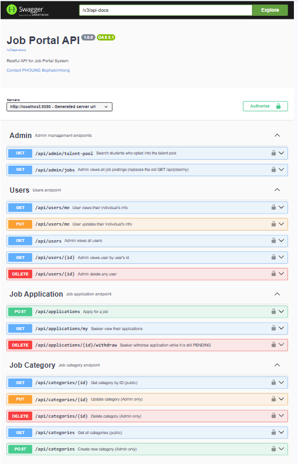
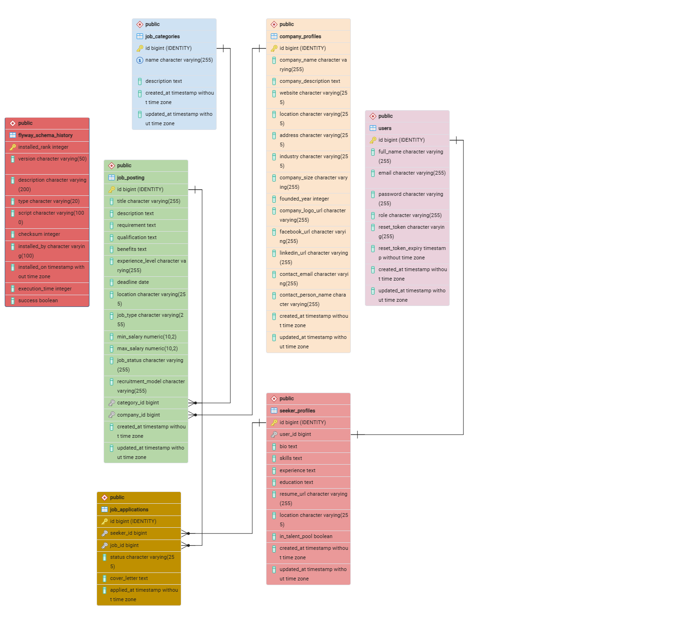

# Job Portal System

A full-featured Job Portal REST API built with Java Spring Boot. It serves **job seekers** and **administrators** through JWT authentication, role-based authorization, job management, resume uploads, and an automatic application workflow that emails every candidate's CV straight to the hiring company's HR contact.


---

## 🚀 Live Demo

[//]: # (Backend API:)

[//]: # (https://job-portal-system-01.onrender.com)

Swagger UI
https://job-portal-system-01.onrender.com//swagger-ui/index.html

---

## 📖 Features

### Authentication
- JWT Authentication
- Register & Login — self-registration always creates a **JOB_SEEKER** account (ADMIN accounts are created manually in the database)
- Role-based authorization (`JOB_SEEKER`, `ADMIN`)
- Password encryption (BCrypt)
- **Forgot & Reset password** — emailed token link, valid for 15 minutes

### Job Management (Admin)
- Create, update, delete, and close job postings — posted directly for a company
- **Recruitment models:** `JOB_BOARD` (public & applyable) and `TALENT_POOL` (hidden from public search)
- Public search with pagination and filters: keyword, location, job type, category, experience level, salary range
- `TALENT_POOL` jobs are automatically excluded from all public listings

### Job Applications (Automatic Flow)
- Apply for a job — an uploaded resume is required
- The CV (resume PDF) is **automatically emailed** to the company's HR contact (`contactEmail`)
- Application status flips from `PENDING` → `SENT` automatically after successful delivery; if the email fails it stays `PENDING` for retry
- Seekers can view their applications and withdraw while still `PENDING`
- No admin involvement in the application lifecycle

### Companies (Admin-managed)
- Standalone company profiles — no linked user accounts
- HR contact info: `contactEmail` (required — where CVs are sent) + optional contact person name
- Company logo upload

### Talent Pool
- Seekers can opt in/out of the talent pool from their profile
- Admin searches pool candidates by skills (comma-separated keywords) and availability (resume on file)

### User Profiles
- Job seeker profile with resume PDF upload
- Company profiles (admin-managed)

### System Features
- Global Exception Handling
- Request Validation
- RESTful API
- Swagger/OpenAPI Documentation
- Email notifications (welcome, CV delivery to HR, CV-sent confirmation, password reset)
- Flyway database migrations

## 🚢 DevOps

- GitHub Actions CI
- Automatic Maven build
- Automatic JUnit test execution
- Docker support
- Render deployment

---

## 🛠 Tech Stack

| Category         | Technology                                 |
|------------------|--------------------------------------------|
| Language         | Java 21                                    |
| Framework        | Spring Boot 4                              |
| Security         | Spring Security + JWT (jjwt)               |
| Database         | Supabase PostgreSQL                        |
| Storage          | Supabase Storage                           |
| ORM              | Spring Data JPA / Hibernate                |
| DB Migrations    | Flyway                                     |
| Mail             | Spring Boot Mail (SMTP + MIME attachments) |
| Build Tool       | Maven                                      |
| API Testing      | Postman                                    |
| Documentation    | Swagger/OpenAPI (springdoc)                |
| Containerization | Docker & Docker Compose                    |
| Deployment       | Render                                     |

---

## 📂 Project Structure

```
src
├── main
│   ├── java/com/kimhong/job_portal
│   │   ├── controller      # REST controllers (Auth, Jobs, Companies, Applications, Admin, ...)
│   │   ├── service         # Business logic (Auth, JobPosting, CompanyProfile, JobApplication, Email, ...)
│   │   ├── repository      # Spring Data JPA repositories
│   │   ├── entity          # JPA entities & enums (Role, ApplicationStatus, RecruitmentModel, ...)
│   │   ├── dto             # Request/Response records
│   │   ├── security        # JWT filter
│   │   ├── config          # Security, OpenAPI, file storage config
│   │   ├── exception       # Global exception handling
│   │   └── util            # JWT utilities
│   └── resources
│       ├── application.yaml
│       └── db/migration    # Flyway migrations (V1 init)
└── test                    # JUnit 5 + Mockito unit tests
```

---

## 🐳 Run Locally

```bash
git clone https://github.com/kimhongkevin/Job_Portal_System.git

cd Job_Portal_System

docker-compose up --build
```

Application runs on:

```
http://localhost:8080
```

---

## 📚 API Documentation

Swagger UI

```
http://localhost:8080/swagger-ui/index.html
```

After deployment:

```
https://job-portal-system-01.onrender.com//swagger-ui/index.html
```

---

## 🔌 API Endpoints Overview

### Authentication — `/api/auth` (public)
| Method | Endpoint | Description |
|--------|----------|-------------|
| POST | `/api/auth/register` | Register a user (always created as `JOB_SEEKER`) |
| POST | `/api/auth/login` | Login, returns JWT |
| POST | `/api/auth/forgot-password` | Emails a reset link (token valid 15 min) |
| POST | `/api/auth/reset-password` | Resets password using the emailed token |

### Job Postings — `/api/jobs`
| Method | Endpoint | Access | Description |
|--------|----------|--------|-------------|
| POST | `/api/jobs` | ADMIN | Create a posting for a company (`companyId` required) |
| GET | `/api/jobs/{id}` | public | View a job |
| PUT | `/api/jobs/{id}` | ADMIN | Update a job |
| DELETE | `/api/jobs/{id}` | ADMIN | Delete a job |
| PATCH | `/api/jobs/close/{id}` | ADMIN | Close a job |
| GET | `/api/jobs/open/paged` | public | Open jobs (only `JOB_BOARD`) |
| GET | `/api/jobs/search/paged` | public | Search jobs (`TALENT_POOL` excluded) |

### Applications — `/api/applications` (JOB_SEEKER)
| Method | Endpoint | Description |
|--------|----------|-------------|
| POST | `/api/applications` | Apply — resume required; CV auto-emailed to company HR |
| GET | `/api/applications/my` | Seeker views their applications |
| DELETE | `/api/applications/{id}/withdraw` | Withdraw while still `PENDING` |

### Companies — `/api/companies`
| Method | Endpoint | Access | Description |
|--------|----------|--------|-------------|
| GET | `/api/companies` | public | List companies |
| GET | `/api/companies/{id}` | public | Company details + active job count |
| GET | `/api/companies/search?keyword=` | public | Search by name |
| POST | `/api/companies` | ADMIN | Create company profile (`contactEmail` required) |
| PUT | `/api/companies/{id}` | ADMIN | Update company profile |
| POST | `/api/companies/{id}/logo` | ADMIN | Upload company logo |

### Seeker Profile — `/api/seeker/profile` (JOB_SEEKER)
| Method | Endpoint | Description |
|--------|----------|-------------|
| POST | `/api/seeker/profile` | Create profile |
| GET | `/api/seeker/profile` | View own profile |
| PUT | `/api/seeker/profile` | Update profile |
| POST | `/api/seeker/profile/resume` | Upload resume PDF (replaces existing) |
| PATCH | `/api/seeker/profile/talent-pool` | Opt in/out of the talent pool |

### Admin & Users
| Method | Endpoint | Access | Description |
|--------|----------|--------|-------------|
| GET | `/api/admin/jobs` | ADMIN | All job postings (replaces old `GET /api/jobs/my`) |
| GET | `/api/admin/talent-pool?skills=&available=` | ADMIN | Talent pool search by skills / resume availability |
| GET | `/api/users` · `/api/users/{id}` | ADMIN | List / view users |
| DELETE | `/api/users/{id}` | ADMIN | Delete a user |
| GET/PUT/DELETE | `/api/categories/**` | public read · ADMIN write | Job categories |


---

## 🔄 Application Status Flow

```
apply ──▶ PENDING ──(CV emailed successfully)──▶ SENT   ← automatic
              │
              ├─ email failed ──▶ stays PENDING (retryable)
              └─ seeker may withdraw while PENDING
```

| Status | Meaning |
|--------|---------|
| `PENDING` | Just applied — CV not sent yet |
| `SENT` | CV successfully emailed to the company HR |
| `REJECTED` | Invalid/spam application cleanup (rare, manual admin action) |

---
## 🗄️ Database & Storage

```
- PostgreSQL (hosted by Supabase)
- Supabase Storage (CVs and company logos)

```

---

## 🗄️ Database Migrations (Flyway)

```
src/main/resources/db/migration
├── V1__init.sql                    # initial schema
   
```

Migrations run automatically on application startup.

---

## 🧪 Testing

Run the unit tests (JUnit 5 + Mockito):

```bash
# Linux / macOS
./mvnw test

# Windows
mvnw.cmd test
```

Current suite: **46 tests** covering registration (JOB_SEEKER-only), login, forgot/reset password,
company profile management, job posting management (admin), and the automatic CV-email application flow.

---

## 🔐 User Roles

| Role | Permissions |
|------|-------------|
| JOB_SEEKER | Browse jobs, apply for jobs (resume required — CV auto-emailed to company HR), upload resume |
| ADMIN | Manage users, companies, job postings, talent pool & platform resources |

---

## 📸 Screenshots

### Swagger UI



### ER Diagram



---

## 👨‍💻 Author

**Phoung Bophakimhong**

GitHub:
https://github.com/kimhongkevin
